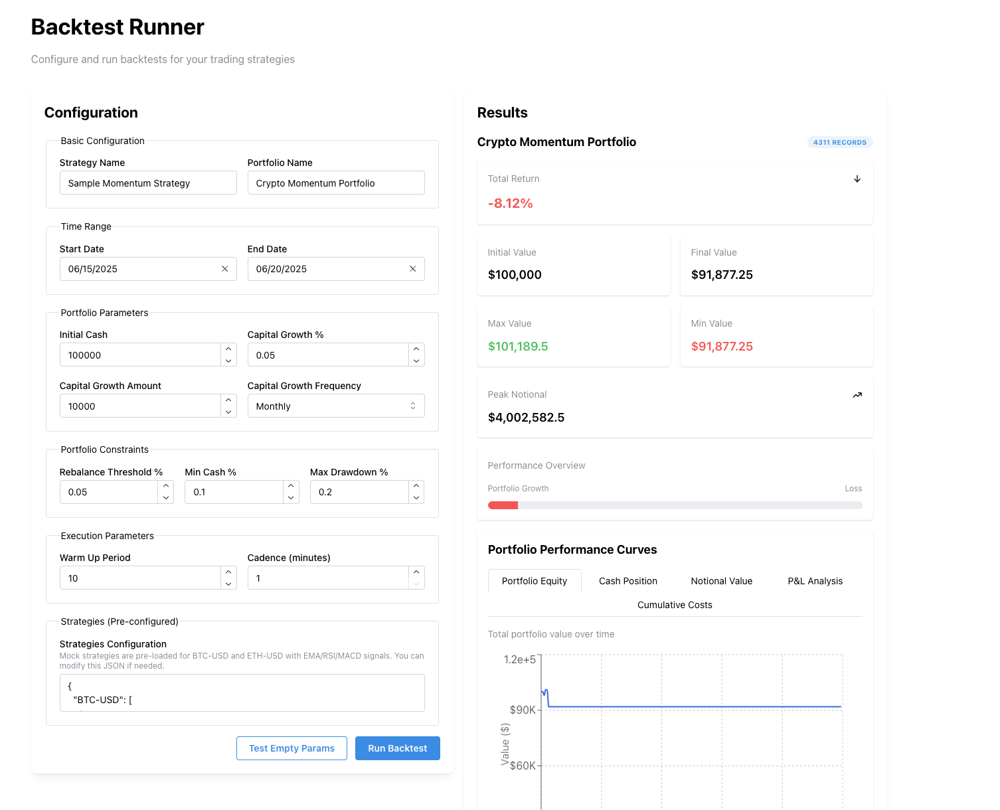

todo tmo:

1. optimize backend (enforce nd array, try to avoid hashmap and vec) DONE
2. properly set up request shape
3. properly set up service
4. ui for configurating strategy

other to-do:
-1. testssss? DONE 0. fix numbers DONE

1. cash logic DONE, cost logic, take profit logic
2. ui for result page

3. cache backtest data(meta: bk id, set up) (key perf) (full results)

- probably should use objecct...)

5. ui and api for showing past backtest (with filter and sort)
6. grid search? need to think it through

- dont think indicator's param should be touched
- strategy combo -> easy, a list
- constraints and port setup, select a range and interval?
- show number of combo to run? and prune by priority?
- show aggregate kep results, also list of backtest?
- gs table ( gs id to bk id)

5. job to cache daily coinbase data

6. a live simulator! this must be funnnn

- at t0, initiation with t-1 data,
- at tk, initiation done,
- at tk + 1, fetch tk data and simulation starts (k periods gap)
- need to optimize initiation too
- dont worry abt this lol

gs level:

- indicator generation level: parameters
- strategy level: different combo of strategy (pos and neg signal)
- portfolio level: loss control, capital injection, trading/rebalance threshold
  static(should base on appetite): - cost multiple (market impact + fixed) - ?
  orders: everything in batch

still need a single date version and a batch version

1. indicator generation
   -> pd, preferably np vectorization + talib
   -> make parameters easily parametrizable
2. signal generation
   -> strategy rules
   -> voting rules
   ------output is an NdArray (T _ n _ p), T - date, n - ticker, p - indicator----
3. lightweight data cacher - just cache a big chunk of price data and move on
   -----output is also NdArray ( T _ n _ p), p-prices or volume
4. can i batch trade? i think i can...
   - steps in trading: market to mkt, check max drawdown, update trail stop price, check stop loss, trade sell, trade buy, market to mkt
   - we need a lot of numpy arrays.... check what xx does

record keeping during trading is important... think through this

failed attempt - but need to pick up later

1. signal strength and weighted vote
2. pair trading (update signal logic, signal generation logic (matrix instead of array))
