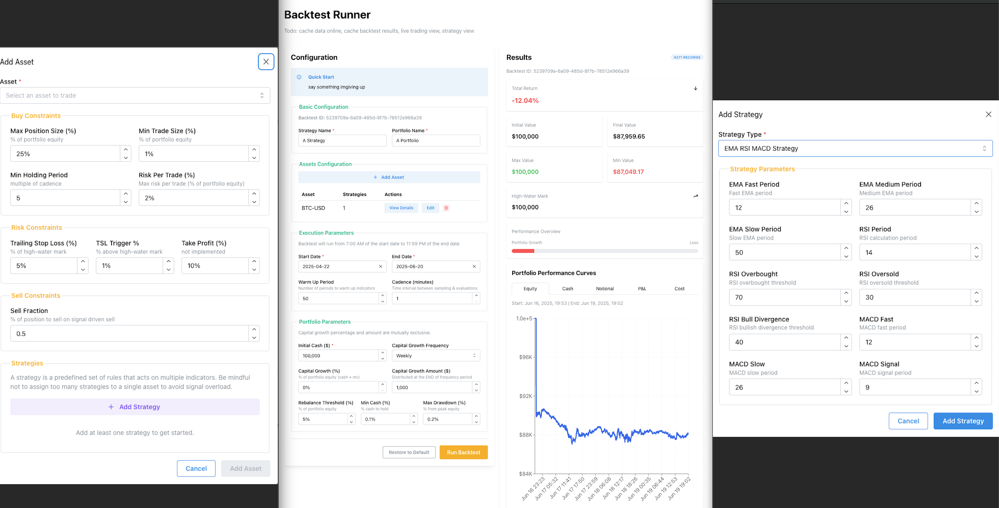

DONE:

1. optimize backend (enforce nd array, try to avoid hashmap and vec) DONE
2. properly set up request shape DONE
3. properly set up service DONE
4. ui for configurating strategy DONE
5. testssss? DONE
6. fix numbers DONE
7. cash logic DONE,
8. job to backfill historical
9. take profit logic done

   to-do:

10. job to cache daily coinbase data
11. set up db service for both be and fe (and read role)

result:

1. when to save a backtest
2. show result properly (show all + metrics)
3. show all run result (grid?)
4. cache backtest data(meta: bk id, set up) (key perf) (full results)

5. cost logic, take profit logic

6. grid search? need to think it through

- dont think indicator's param should be touched
- strategy combo -> easy, a list
- constraints and port setup, select a range and interval?
- show number of combo to run? and prune by priority?
- show aggregate kep results, also list of backtest?
- gs table ( gs id to bk id)

6. a live simulator! this must be funnnn

- at t0, initiation with t-1 data,
- at tk, initiation done,
- at tk + 1, fetch tk data and simulation starts (k periods gap)
- need to optimize initiation too
- dont worry abt this lol

failed attempt - but MAYBE to pick up later

1. signal strength and weighted vote
2. pair trading (update signal logic, signal generation logic (matrix instead of array))
